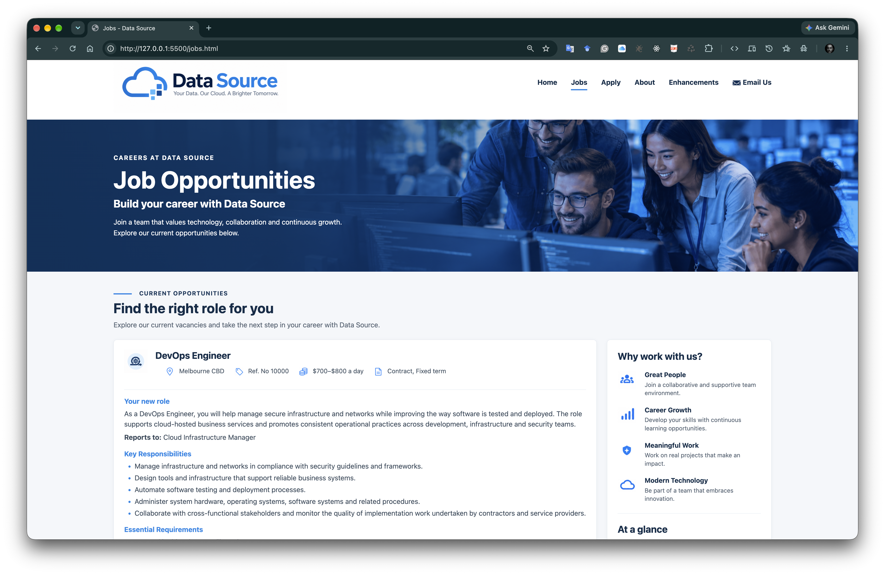
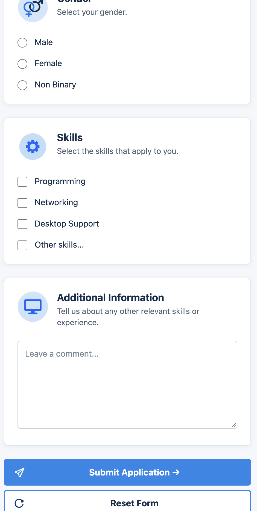

# Data Source

Data Source is a multi-page web development project originally created from university assignment requirements and subsequently prepared as a portfolio demonstration. It presents a fictional technology company offering data hosting and cloud software services, together with sample job vacancies and an application workflow.

This repository is an educational portfolio/demo project. It is not a real company website, production recruitment system, or commercial client project.

## Project Preview


## Project Overview

The website demonstrates foundational front-end development across five connected pages:

- a company homepage with service and technology-provider content
- detailed job opportunities and supporting employment information
- a structured job application form
- a portfolio-safe About page adapted from the original academic profile content
- documentation of the responsive-design enhancement

The portfolio version preserves relevant assignment constraints while incorporating the later responsive-design enhancement, accessibility considerations, validation work, and repository-quality improvements that are present in the codebase.

## Technology Stack

- HTML5 with semantic page structure
- CSS3 in one shared external stylesheet
- CSS custom properties, responsive media queries, floats, Flexbox, and Grid
- native HTML5 form validation using input types, required fields, lengths, and patterns
- HTTP `POST` form submission
- PHP for the repository-local demonstration form processor

No JavaScript is used, and no JavaScript source files are present in the repository.

PHP has two distinct roles when working with this project:

1. PHP's built-in server can serve the project during local development.
2. The repository contains `process_apply.php`, a small local endpoint that handles the Apply form submission.

The PHP processor is application code in this repository, but it is intentionally limited to local demonstration and verification. It is not a production backend.

## Website Structure

| Page | Purpose |
| --- | --- |
| `index.html` | Introduces the fictional company, its services, recruitment call to action, and cloud providers. |
| `jobs.html` | Presents two sample job descriptions, requirements, rates, employment information, and an application link. |
| `apply.html` | Provides the job application form and native browser-side validation constraints. |
| `about.html` | Presents a portfolio-safe version of the original assignment's developer profile and timetable structure. |
| `enhancements.html` | Documents and links to the breakpoint-specific responsive-design enhancement. |

All five pages share the primary navigation, visual language, page assets, stylesheet, and footer components.

## Jobs Page Preview

The Jobs page demonstrates structured vacancy information and responsive presentation for the page layout and vacancy cards.



## Application Form and PHP Processing

The form in `apply.html` uses:

- `method="post"`
- `action="process_apply.php"`

`process_apply.php` is stored in the repository root. It accepts only HTTP `POST` requests and returns a plain-text confirmation containing the submitted field names and values. It does not store applications, send email, authenticate users, or provide a production recruitment workflow. The PHP processor checks the request method but does not perform server-side validation of individual form fields; those constraints are currently enforced by the browser through HTML attributes.

```text
User
  |
  v
apply.html
  |
  | HTTP POST
  v
process_apply.php
  |
  v
Plain-text demonstration response
```

Before submission, the browser applies the form's native HTML5 constraints. These include required fields, email and telephone input types, maximum and minimum lengths, and regular-expression patterns for fields such as the job reference, names, postcode, phone number, and date of birth.

Because the processor displays submitted form values in its response, use fictional test data during development.

## Running the Project Locally

### 1. PHP Development Server

Use PHP's built-in server to test the complete project, including the local form processor.

On macOS, check whether PHP is available:

```bash
php --version
```

If it is not installed and Homebrew is available:

```bash
brew install php
```

Start the server from the repository root:

```bash
cd /path/to/Assignment1-DataSource
php -S localhost:8000
```

Open [http://localhost:8000](http://localhost:8000) in a browser. Stop the server with `Ctrl+C`.

Using PHP's built-in server does not by itself make a project a PHP application; in this repository, PHP is also genuinely required to execute the local `process_apply.php` form endpoint.

### 2. Visual Studio Code Live Server

For rapid HTML/CSS preview:

1. Open the repository in Visual Studio Code.
2. Open `index.html`.
3. Choose **Open with Live Server** or select **Go Live**.
4. Open the generated address, commonly [http://127.0.0.1:5500/](http://127.0.0.1:5500/). The port may vary.

Live Server serves static HTML, CSS, and image files. It does not execute local PHP code, so use the PHP development server when testing form submission to `process_apply.php`.

## Repository Structure

```text
Assignment1-DataSource/
├── index.html
├── jobs.html
├── apply.html
├── about.html
├── enhancements.html
├── process_apply.php
├── README.md
├── .gitignore
├── images/
│   └── content, interface, and form image assets
└── styles/
    ├── style.css
    └── images/
        └── CSS background and generated-content assets
```

The current `.gitignore` excludes macOS and Windows metadata, the `.vscode/` and `.idea/` configuration directories, common temporary/editor files, and local environment files.

## Responsive Design

The default desktop layouts use a mixture of floats, Flexbox, Grid, fluid widths, and constrained content containers. The stylesheet then applies verified adaptations at three breakpoints:

- `max-width: 900px`: reduces gutters and logo size, adjusts form proportions, and stacks the Jobs listings and aside.
- `max-width: 48rem`: stacks the header, Home service cards, Join Our Team content, cloud providers, About details, application-form sections, and footer columns; it also reduces spacing and makes form groups and actions full width on narrow screens.
- `max-width: 600px`: further refines the Jobs banner, cards, metadata, aside, and full-width Apply buttons.

`enhancements.html` explains how these changes go beyond simply narrowing fluid layouts by restructuring components for tablet and mobile viewports.

### Desktop and Mobile

| Desktop | Mobile |
| --- | --- |
|  |  |

### Mobile Application Form

At narrow viewport widths, the application form restructures into full-width stacked cards and controls.



## Accessibility Considerations

The implementation includes:

- semantic landmarks and content elements such as `header`, `nav`, `main`, `section`, `article`, `aside`, `figure`, and `footer`
- one primary heading per page with logical subordinate headings
- an accessible label for the main navigation
- descriptive alternative text for content images and empty alternatives for decorative images
- explicitly associated form labels and controls
- fieldsets with legends, including visually hidden legends where the visible card heading supplies the visual context
- visible keyboard-focus styles for navigation, calls to action, form controls, buttons, and footer links
- table captions and scoped table headings
- native HTML5 form validation

These are implementation-level accessibility considerations. They are not presented as a separate formal assignment enhancement and do not constitute a claim of formal WCAG conformance.

## Assignment Constraints

The original implementation was shaped by confirmed university assignment requirements and conventions, including:

- five required pages with fixed filenames
- semantic HTML5 content and a shared external CSS stylesheet
- company, vacancy, application-form, student-profile, and enhancement content
- separation of HTML content from CSS presentation
- a form submitted with HTTP `POST` to a PHP processor
- native HTML form constraints and prescribed field content
- documentation of work implemented beyond the baseline requirements

The codebase contains no JavaScript and preserves the assignment's HTML/CSS-focused implementation. That choice reflects the project context rather than a recommendation that modern websites should avoid JavaScript.

## Baseline Requirements vs Enhancements

| Area | Baseline implementation | Portfolio enhancement present in the repository |
| --- | --- | --- |
| Page layout | Fluid widths and layouts that resize or reflow | Breakpoint-specific component restructuring at `900px`, `48rem`, and `600px` |
| Home | Multi-column service content and side-by-side recruitment section | Stacked services, recruitment content, and providers on mobile |
| Jobs | Desktop 75/25 listings-and-aside layout | Stacked tablet layout plus vertical metadata and full-width mobile actions |
| Apply | Multi-column form cards and rows | Full-width stacked form content and controls on mobile |
| About | Photograph beside personal details | Centred photograph above full-width details on mobile |

Only the responsive-design enhancement documented by `enhancements.html` is claimed here. No additional enhancement is inferred from metadata or styling alone.

## Validation and Testing

Release-preparation work recorded in the repository includes HTML and CSS validation and a final semantic/style audit. The current review covers:

- HTML document structure and heading hierarchy
- CSS syntax and selector usage
- navigation, fragments, local links, and asset paths
- form labels, field associations, constraints, and POST target
- responsive rules at the documented breakpoints
- keyboard-focus presentation and accessibility considerations
- duplicate IDs, obsolete markup, and unused or unnecessarily duplicated CSS
- repository status, ignore rules, and release documentation

Browser resizing, keyboard-only navigation, and form submissions should be repeated when preparing a public release or changing page behavior. A PHP-capable web server is required to execute the repository-local processor. For local development, this README uses PHP's built-in development server; Live Server is sufficient only for static preview.

## Portfolio and Privacy Review

This portfolio branch has been prepared for public portfolio presentation. A release review should continue to check for:

- temporary and generated files
- operating-system metadata and unnecessary editor files
- secrets, credentials, and environment-specific data
- unnecessary personal information
- academic identifiers and contact details

The academic/submission version on `main` intentionally retains student-specific material required by the original assignment. This portfolio branch removes or anonymises student identifiers, academic contact details, tutor information, and real timetable data without changing the preserved academic version.

This README deliberately does not reproduce student identifiers or student contact details.

## Project Status

Data Source is maintained as a portfolio demonstration of foundational front-end development, semantic HTML, responsive CSS, accessible form structure, native validation, and a minimal local PHP form workflow.

It is not a production system, deployed recruitment platform, or real client website.

## Author

Nikolaos Anestakis
